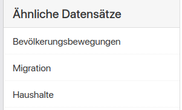

ckanext-similar-datasets
#################

*ckanext-similar-datasets* war ursprünglich Teil des größeren ckanext-discovery Plugins und kann jetzt als eigenständiges Plugin genutzt werden.
Getestet wurde das Plugin mit CKAN 2.9.
Andere Versionen wurden nicht getestet. Feedback zur Funktionalität mit anderen Versionen sind herzlich Willkommen.

similar_datasets fügt eine Liste ähnlicher Datensätze zu ihrer Datensatz-Detailsicht hinzu. 

Installation
============

Aktivieren Sie zuerst die CKAN-Umgebung::

    . /usr/lib/ckan/default/bin/activate

Dann installieren Sie die das dieses Plugin::

    pip install -e git+https://github.com/ondics/ckanext-similar-datasets#egg=ckanext-similar-datasets

Wenn Sie eine bestimmte Version installieren möchten, können Sie es im wie folgt angeben:

    pip install -e git+https://github.com/ondics/ckanext-similar-datasets@v0.1.1#egg=ckanext-similar-datasets

Das Plugin verlässt sich auf Solr's `More Like This`_ Feature und somit muss die Solr Instanz noch richtig konfiguriert werden.
Genauer müssen Sie einen MoreLikeThisHandler_ in Ihrer ``/etc/solr/conf/solrconfig.xml`` einrichten.
Dafür fügen Sie folgenden Code Block direkt vor dem ``</config>`` Tag am Ende der Datei ein:

    <requestHandler name="/mlt" class="solr.MoreLikeThisHandler">
        <lst name="defaults">
            <int name="mlt.mintf">3</int>
            <int name="mlt.mindf">1</int>
            <int name="mlt.minwl">3</int>
        </lst>
    </requestHandler>

Bitte beziehen Sie sich auf die Dokumentation des MoreLikeThisHandler_ für die Konfigurationsdetails.
Zusätzlich müssen Sie `term vector storage`_ für das ``text`` Feld
in Ihrer ``/etc/solr/conf/schema.xml`` aktivieren. Dafür finden Sie bitte folgende Feld Definition in der Datei::

    <field name="text" type="text" indexed="true" stored="false" multiValued="true" />

Dann fügem Sie``termVectors="true"`` zur Liste der Attribute hinzu, so dass es wie folgt aussieht::

    <field name="text" type="text" indexed="true" stored="false" multiValued="true" termVectors="true" />

Bitte beachten Sie, dass term vectors substanziell die Größe Ihres Solr Index erhöhen können.

Dann müssen Sie Solr neustarten. Wenn Sie jetty benutzen, benutzen Sie folgenden Code::

    sudo service jetty restart

Zum Schluss müssen Sie einmalig ihre Datensätze neu indizieren,
damit die Term Vektoren der bereits existierenden Datensätzen gespeichert sind (zukünftige Datensätze werden automatisch hinzugefügt)::

    . /usr/lib/ckan/default/bin/activate
    ckan -c /etc/ckan/default/ckan.ini search-index rebuild

Fügen Sie ``similar-datasets`` zu Ihrere Liste aktiver Plugins in der CKAN Konfigurations INI hinzu::
    
    plugins = ... similar_datasets

und starten Sie CKAN neu::

    sudo service apache2 restart

oder

    sudo supervisorctl restart ckan-uwsgi:

Konfiguration
-------------
Das Plugin bietet eine zusätzliche Einstellung an, die in der CKAN Konfigurationsdatei hinzugefügt und angepasst werden kann::

    # Die maximale Anzahl an ähnlichen Datensätzen die gelistet werden können. Default ist 5.
    ckanext.similar_datasets.max_num = 5

Lizenz
=======
Copyright (C) 2021 Ondics GmbH (www.ondics.de)

Distributed in der the GNU Affero General Public License. See the file
``LICENSE`` for details.

.. _CKAN: http://ckan.org
.. _configuration INI: http://docs.ckan.org/en/latest/maintaining/configuration.html#ckan-configuration-file
.. _package_search: http://docs.ckan.org/en/latest/api/index.html#ckan.logic.action.get.package_search
.. _More Like This: https://cwiki.apache.org/confluence/display/solr/MoreLikeThis
.. _MoreLikeThisHandler: https://cwiki.apache.org/confluence/display/solr/MoreLikeThis#MoreLikeThis-ParametersfortheMoreLikeThisHandler
.. _term vector storage: https://cwiki.apache.org/confluence/display/solr/Field+Type+Definitions+and+Properties#FieldTypeDefinitionsandProperties-FieldDefaultProperties
.. _template snippet: http://docs.ckan.org/en/latest/theming/templates.html#snippets

